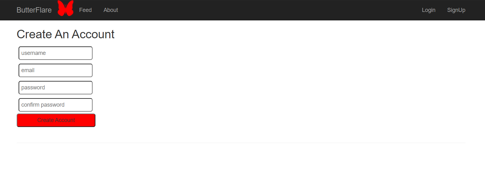
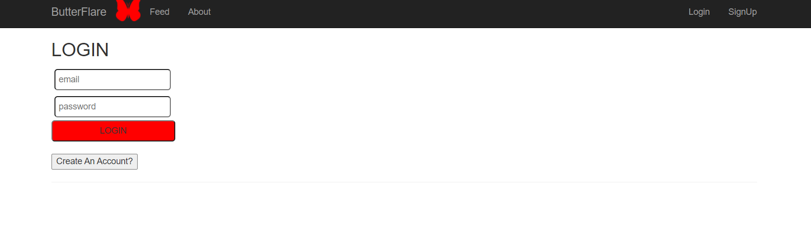
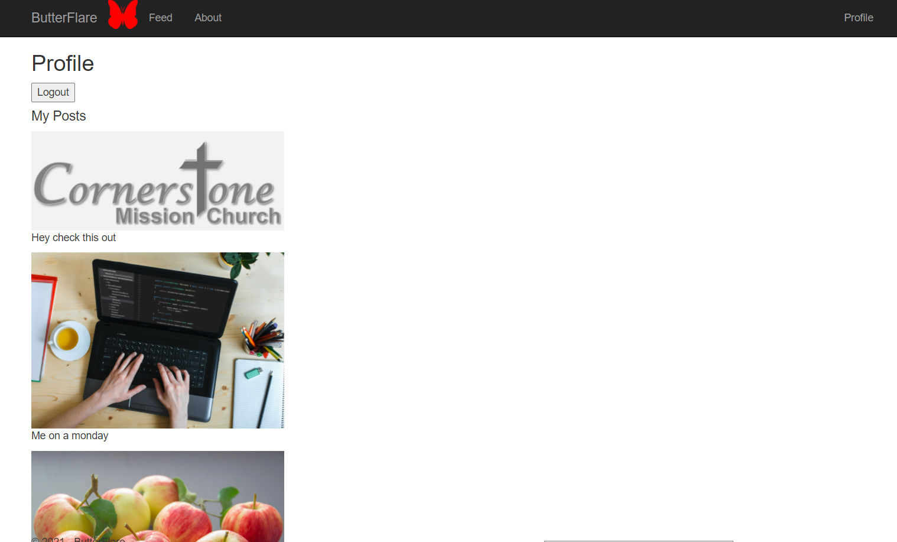
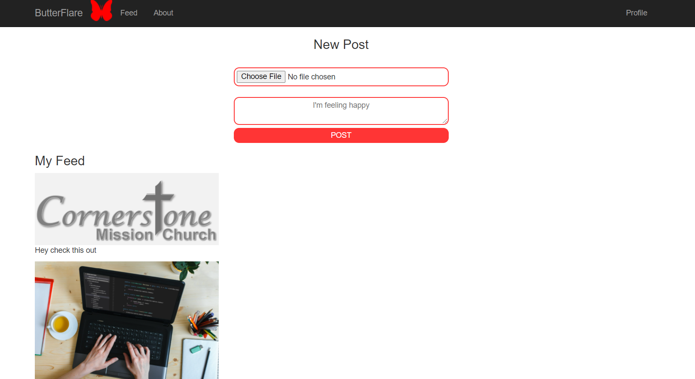
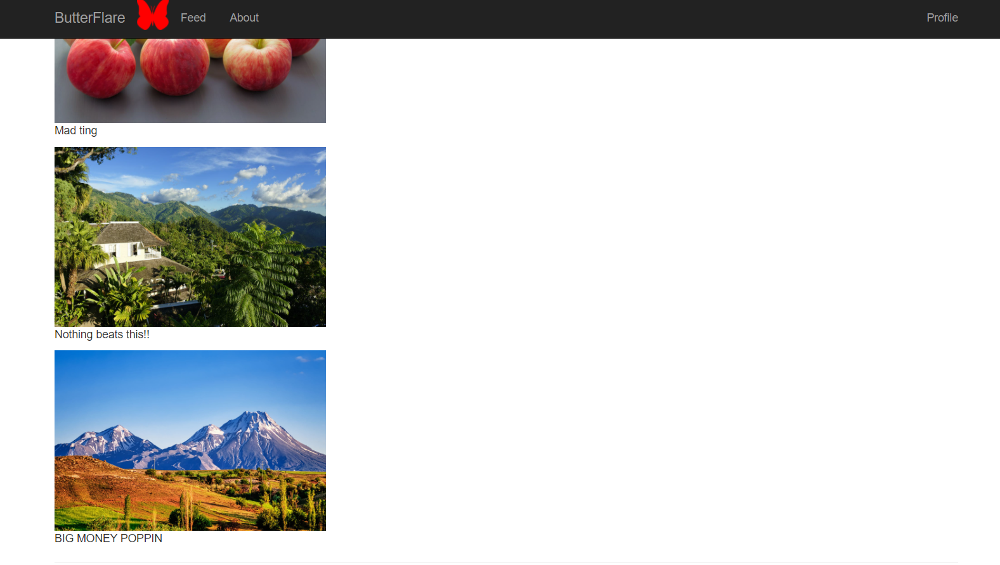

# ButterFlare
A barebones social media app in ASP.net Framework MVC.
Just a simple project to learn basic CRUD in ASP.net

---
### Features
- User login and sign-up using database
- Create posts with image and caption
- Profile page

### Uses:
- Entity Framework
- MS SQL Server database
- FormsAuthentication
- Guid
- Password hash + salting

## Screenshots:

Sign Up:

Login:

Profile:

Feed:

Feed cntd: 

